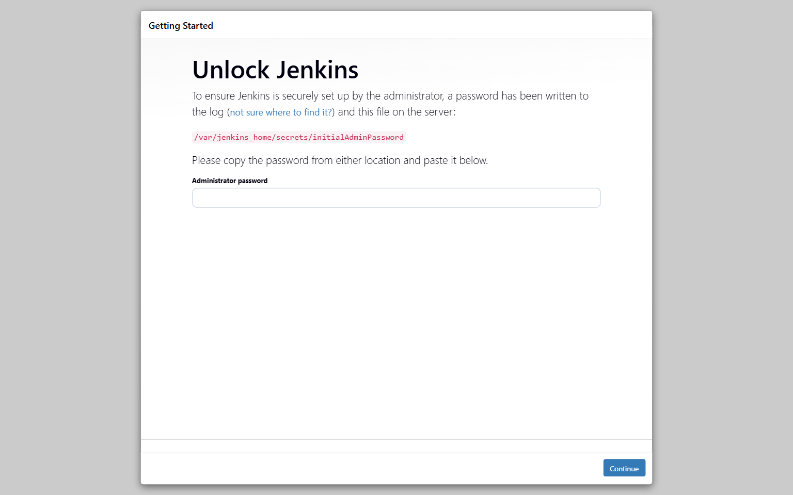
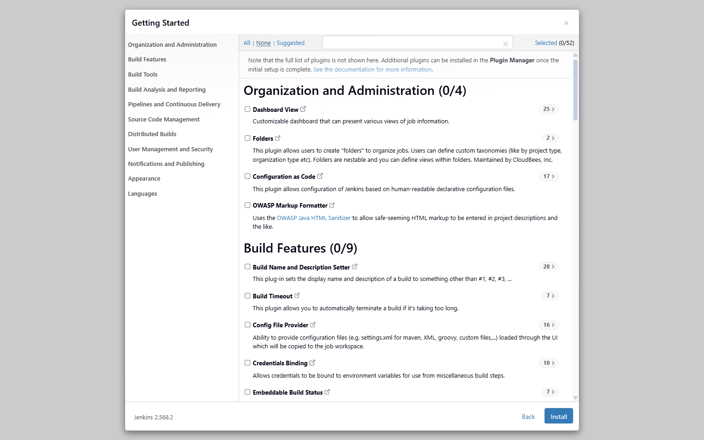
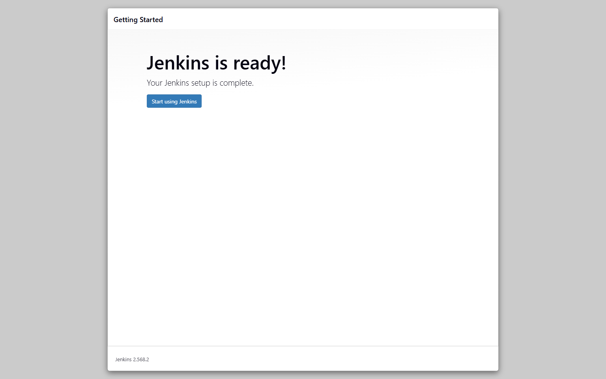
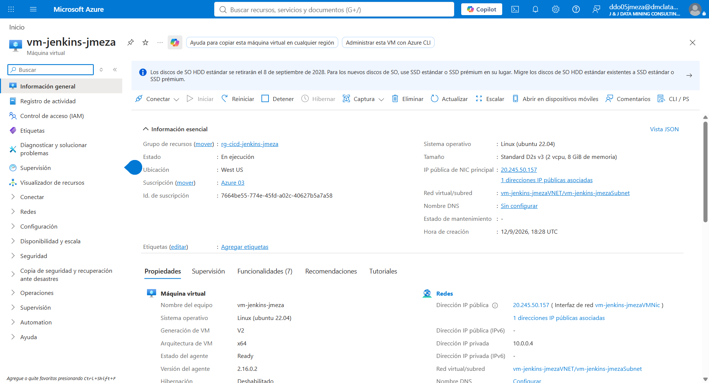
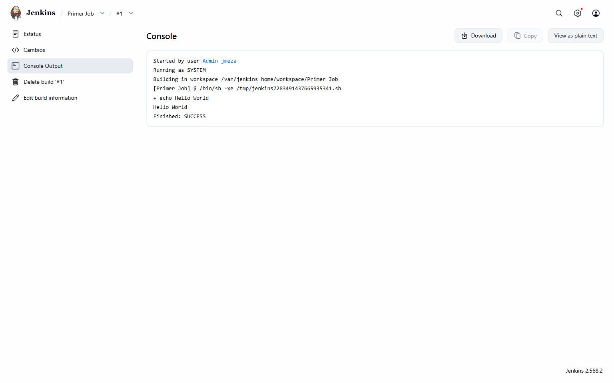
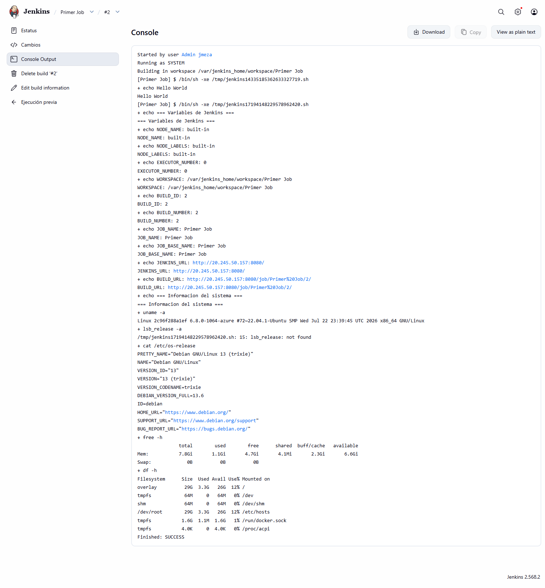

# Laboratorio 5 - Instalacion y primer Job en Jenkins

**Autor:** Joe Meza  
**Fecha de ejecucion:** 12 de septiembre de 2026  
**Repositorio:** `company-jmeza/ms-nodejs-backend-jenkins`

## Objetivo

Instalar Jenkins sobre una maquina virtual de Azure mediante Docker, completar la configuracion inicial sin plugins sugeridos y ejecutar un proyecto Freestyle con comandos shell y variables proporcionadas por Jenkins.

## Ejercicio N° 1 - Instalacion de Jenkins en una VM de Azure

### Infraestructura

| Componente | Valor |
|---|---|
| Grupo de recursos | `rg-cicd-jenkins-jmeza` |
| Maquina virtual | `vm-jenkins-jmeza` |
| Sistema operativo | Ubuntu 22.04 LTS |
| Jenkins | `2.568.2-jdk21` en Docker |
| Persistencia | Volumen Docker `jenkins_home` |
| Job | `Primer Job` |

### Desarrollo

Jenkins fue desplegado en un contenedor con persistencia y acceso al socket Docker del host. La clave inicial se utilizo solamente durante el desbloqueo y no se incluyo en el repositorio ni en este informe. Durante el asistente inicial se eligio la instalacion sin plugins sugeridos y se creo un administrador propio.

### Evidencias del ejercicio 1









## Ejercicio N° 2 - Creacion y ejecucion de Primer Job

El primer paso del proyecto Freestyle fue:

```bash
echo "Hello World"
```

La ejecucion numero 1 termino en `SUCCESS`. Luego se agrego un segundo paso para imprimir variables de Jenkins y datos del sistema:

```bash
echo "NODE_NAME: $NODE_NAME"
echo "NODE_LABELS: $NODE_LABELS"
echo "EXECUTOR_NUMBER: $EXECUTOR_NUMBER"
echo "WORKSPACE: $WORKSPACE"
echo "BUILD_ID: $BUILD_ID"
echo "BUILD_NUMBER: $BUILD_NUMBER"
echo "JOB_NAME: $JOB_NAME"
echo "JOB_BASE_NAME: $JOB_BASE_NAME"
echo "JENKINS_URL: $JENKINS_URL"
echo "BUILD_URL: $BUILD_URL"
uname -a
lsb_release -a || cat /etc/os-release
free -h
df -h
```

La ejecucion numero 2 tambien termino en `SUCCESS` y mostro las variables y recursos esperados.

### Evidencias del ejercicio 2





## Resultado

Jenkins quedo operativo con almacenamiento persistente. Las dos ejecuciones de `Primer Job` finalizaron correctamente y verificaron tanto la ejecucion shell basica como la disponibilidad de las variables internas y la informacion del sistema.

## Seguridad

No se documentaron la clave inicial, la contrasena administrativa, claves SSH ni tokens. Las credenciales locales se mantienen fuera del repositorio.
