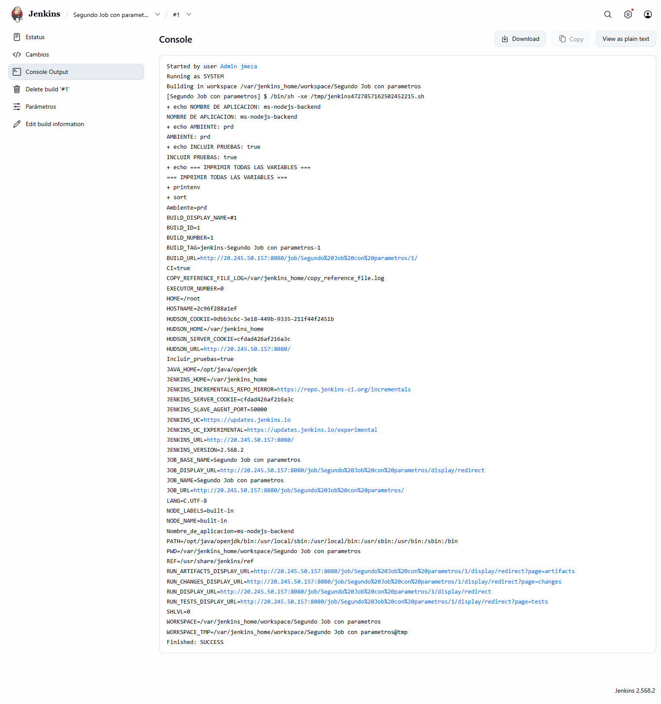
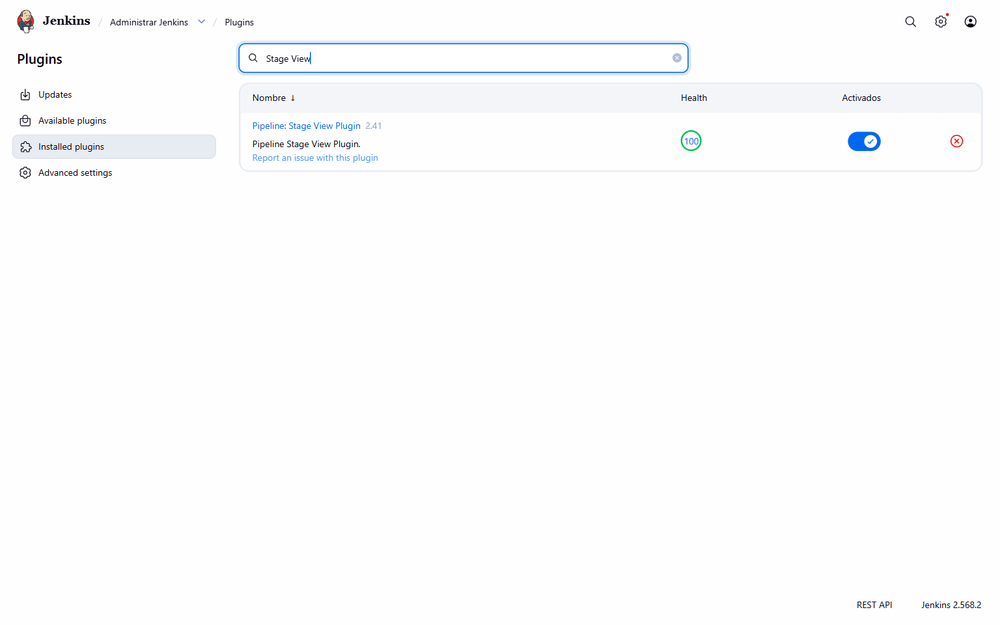
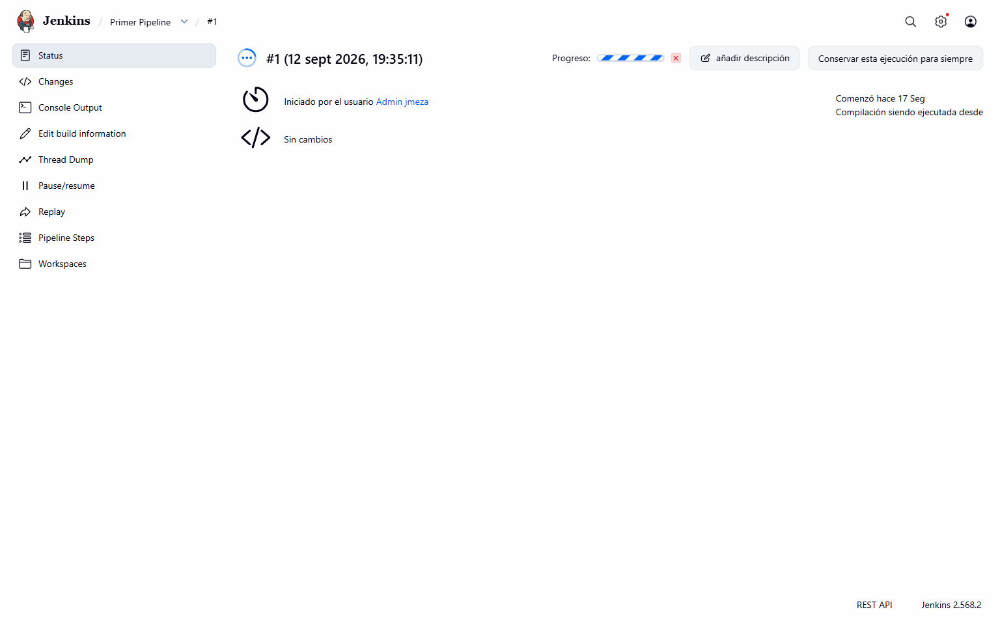
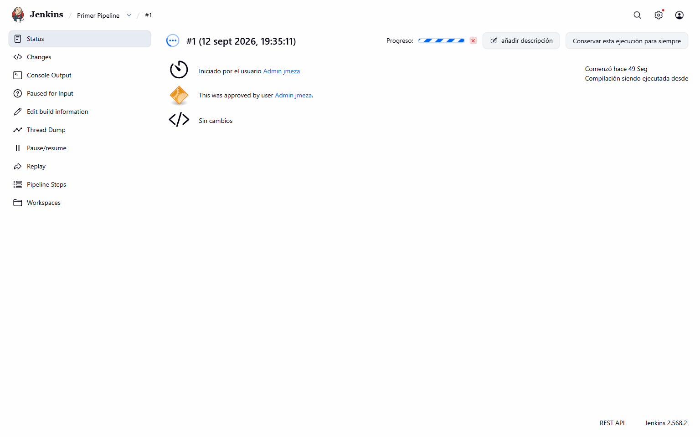
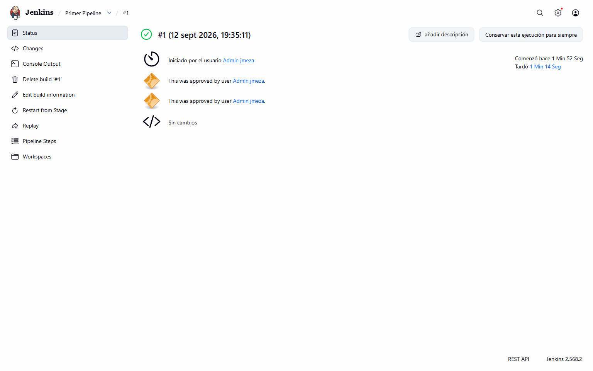
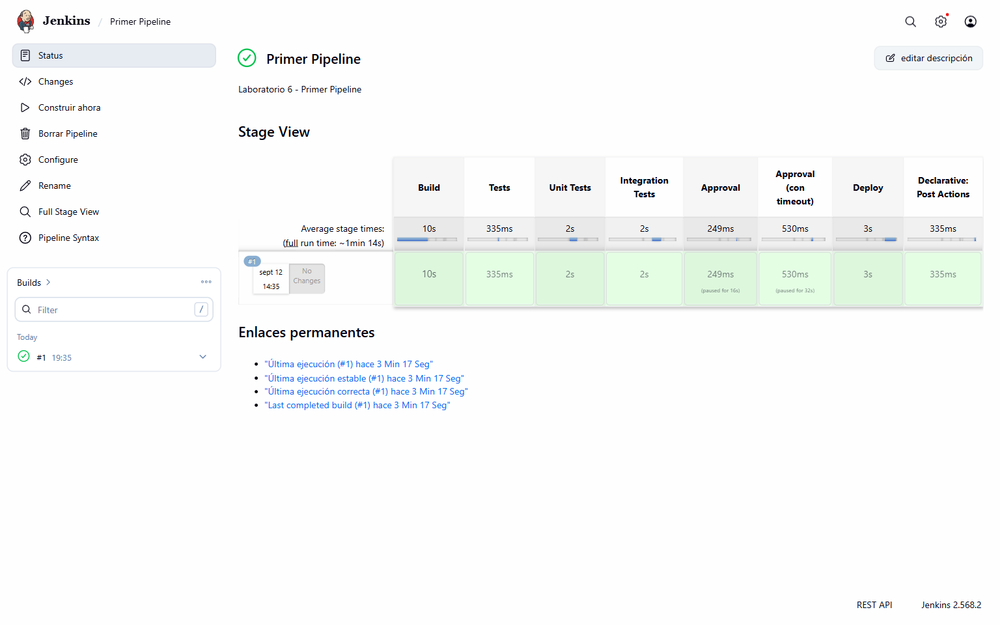
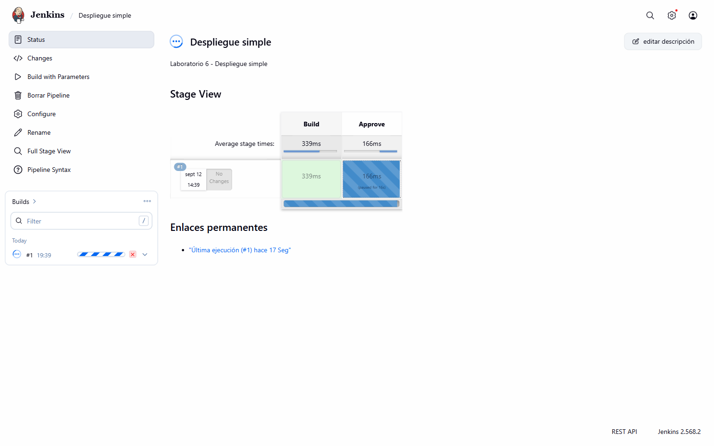
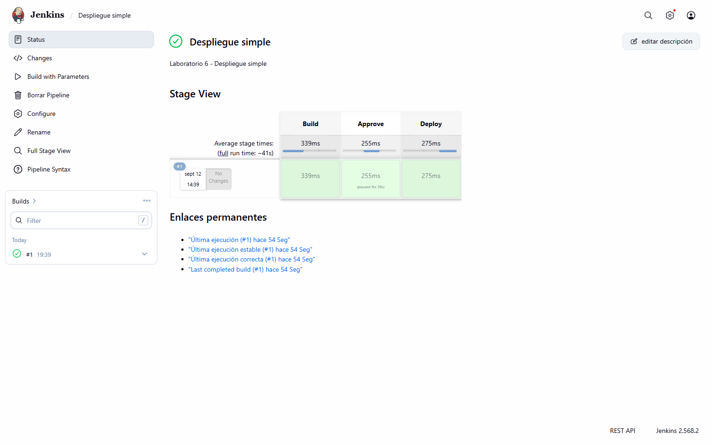

# Laboratorio 6 - Jobs parametrizados y Pipelines en Jenkins

**Autor:** Joe Meza  
**Fecha de ejecucion:** 12 de septiembre de 2026  
**Repositorio:** `company-jmeza/ms-nodejs-backend-jenkins`

## Objetivo

Instalar los plugins de Pipeline y Stage View, crear un job Freestyle parametrizado y ejecutar pipelines declarativos con stages paralelos, aprobaciones manuales y visualizacion grafica.

## Ejercicio N° 1 - Job parametrizado

Se creo `Segundo Job con parametros` con estas entradas:

| Parametro | Tipo | Valores usados |
|---|---|---|
| `Nombre_de_aplicacion` | String | `ms-nodejs-backend` |
| `Ambiente` | Choice | `dev`, `qa`, `prd` |
| `Incluir_pruebas` | Boolean | `true` |

El shell imprimio los parametros y `printenv | sort`. La ejecucion numero 1 finalizo en `SUCCESS` y se validaron los valores `ms-nodejs-backend`, `prd` y `true`.

### Evidencia del ejercicio 1

## Ejercicio N° 2 - Creacion de un Pipeline basico

### Plugins instalados

| Plugin | Version validada | Estado |
|---|---|---|
| Pipeline | `608.v67378e9d3db_1` | Activo |
| Pipeline: Stage View | `2.41` | Activo |

### Ejecucion

El pipeline ejecuto:

1. Build con simulacion de compilacion.
2. Unit Tests e Integration Tests en paralelo.
3. Aprobacion manual.
4. Aprobacion manual protegida por timeout de cinco minutos.
5. Deploy simulado.
6. Acciones `post` para resultado global.

Las dos aprobaciones fueron atendidas y todos los stages quedaron verdes. El resultado final fue `SUCCESS`.

### Evidencias del ejercicio 2

## Ejercicio N° 3 - Pipeline Despliegue simple

Se implemento un pipeline parametrizado con los stages `Build`, `Approve` y `Deploy`. La ejecucion uso `ms-nodejs-backend` y `qa`, espero aprobacion manual y termino con el mensaje `Aplicacion ms-nodejs-backend desplegada en qa`.

### Evidencias del ejercicio 3

## Resultado

Los plugins requeridos quedaron activos y visibles. El job parametrizado, el pipeline paralelo con dos controles manuales y el despliegue simple finalizaron en `SUCCESS`; Stage View reflejo el avance y el resultado de cada stage.
