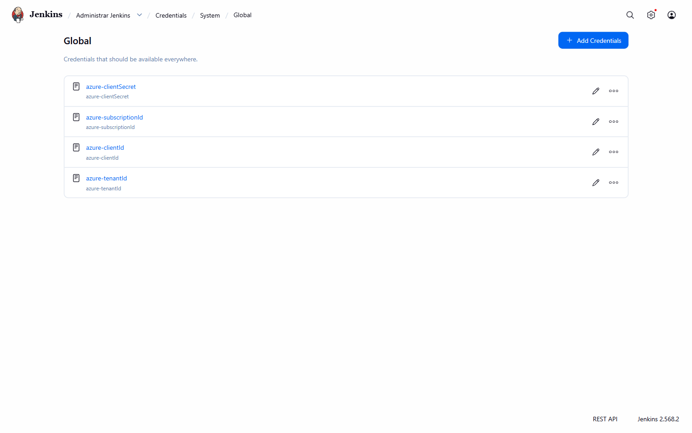
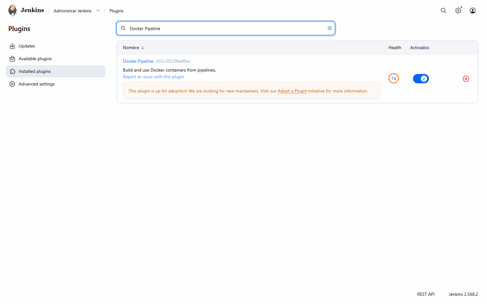
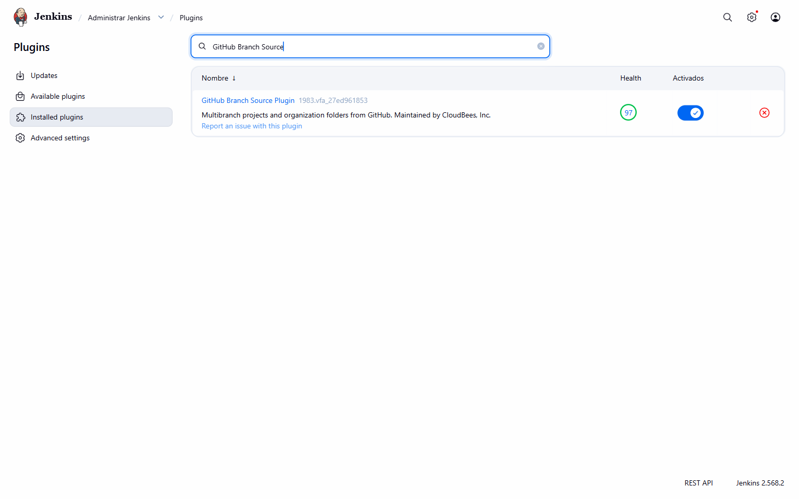
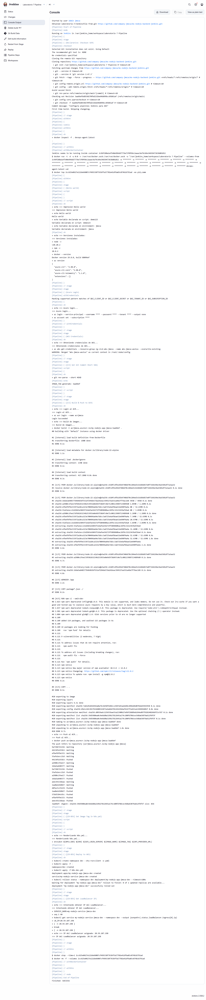
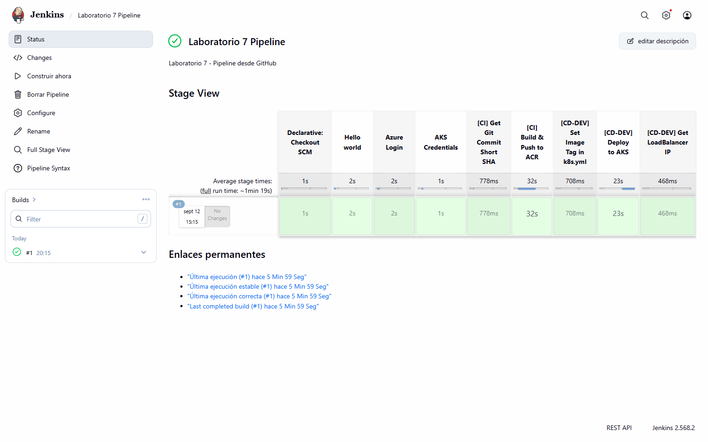
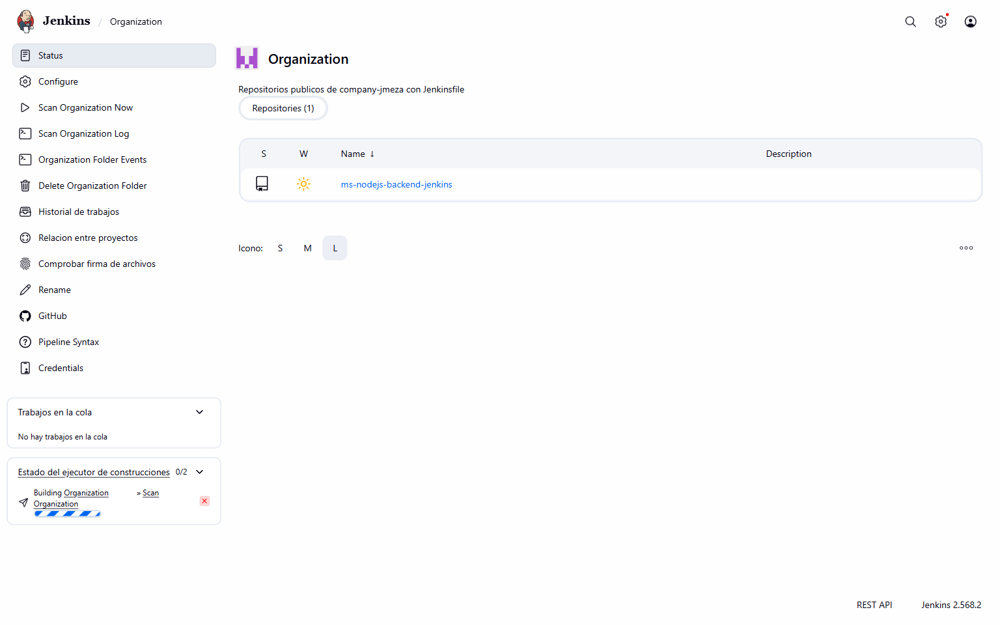

# Laboratorio 7 - Jenkins, Docker, GitHub y AKS

**Autor:** Joe Meza  
**Fecha de ejecucion:** 12 de septiembre de 2026  
**Organizacion:** `company-jmeza`  
**Repositorio:** `ms-nodejs-backend-jenkins`

## Objetivo

Integrar Jenkins con Docker, GitHub Organization y Azure, construir un agente DevOps con las herramientas requeridas, publicar una imagen en ACR y desplegar la aplicacion en AKS.

## Prerrequisito - Infraestructura AKS

Terraform fue adaptado para usar exclusivamente recursos propios:

| Recurso | Valor |
|---|---|
| Grupo de recursos | `rg-cicd-aks-jmeza` |
| Cluster | `aks-jmeza-westus` |
| Region | West US |
| Nodo | `Standard_D2_v3`, autoscaling 1-2 |
| ACR existente | `acrjmeza` |
| Integracion | Rol `AcrPull` para la identidad kubelet |

El plan inicial fue `3 to add, 0 to change, 0 to destroy`. Azure rechazo `Standard_B2s` para esta suscripcion y region; se selecciono `Standard_D2_v3`, disponible y dentro de cuota. El apply final creo AKS y el rol sin crear ni modificar el ACR.

## Ejercicio N° 1 - Instalacion de plugins y credenciales

Se instalaron y validaron `Docker Pipeline`, `GitHub Branch Source`, `Pipeline` y `Pipeline: Stage View`. Jenkins almacena los IDs `azure-clientId`, `azure-clientSecret`, `azure-subscriptionId`, `azure-tenantId` y `github-credentials`; ninguna captura muestra sus valores.

La identidad `sp-jenkins-jmeza-cicd` tiene permisos limitados:

- `AcrPush` sobre `acrjmeza`.
- `Azure Kubernetes Service Cluster User Role` sobre `aks-jmeza-westus`.

### Evidencias del ejercicio 1







## Ejercicio N° 2 - Construccion del agente Docker

Se construyo `devops-agent:latest` sobre Ubuntu 22.04 con Git, Node.js 20, npm, Docker CLI, Azure CLI, kubectl y envsubst. El pipeline se ejecuto dentro del agente y monto el socket Docker del host para construir la imagen de la aplicacion.

### Evidencia del ejercicio 2

La consola de la ejecucion muestra las versiones de Node.js, npm, Docker y Azure CLI proporcionadas por `devops-agent:latest`.



## Ejercicio N° 3 - Integracion con GitHub Organization

El Organization Folder `Organization` consulto `company-jmeza` con una credencial Jenkins. El escaneo proceso cinco repositorios, encontro `laboratorio-7/Jenkinsfile` en `ms-nodejs-backend-jenkins`, creo la rama `main` y ejecuto el pipeline con resultado `SUCCESS`.

### Pipeline DEV

El pipeline realizo Hello World, versionado de herramientas, Azure Login, obtencion de credenciales AKS, generacion del SHA corto, build/push a ACR, render del manifiesto, despliegue y consulta de IP. La imagen fue:

```text
acrjmeza.azurecr.io/my-nodejs-app-jmeza:3aa66ef
```

El deployment `my-nodejs-app-jmeza-dev` quedo `1/1 Running` y el endpoint `/api/items` respondio HTTP 200.

### Evidencias del ejercicio 3





## Resultado

Jenkins quedo integrado con GitHub, Docker, ACR y AKS. Tanto el job SCM directo como la rama descubierta por Organization Folder finalizaron en `SUCCESS`, y la aplicacion DEV quedo accesible mediante LoadBalancer.

## Seguridad

No se publican secretos, tokens, claves privadas, kubeconfig ni contrasenas. La identidad Azure fue creada exclusivamente para estos laboratorios y se elimina durante la limpieza final.
