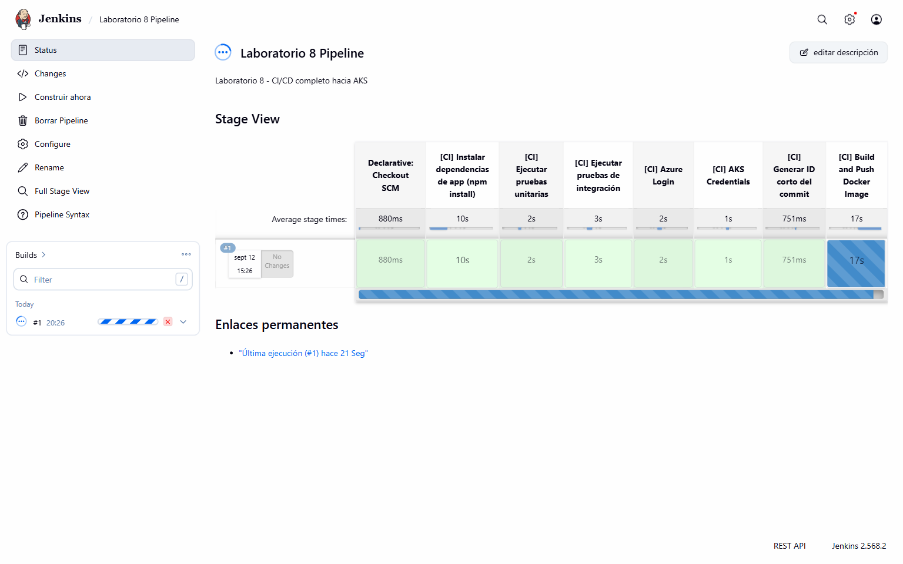
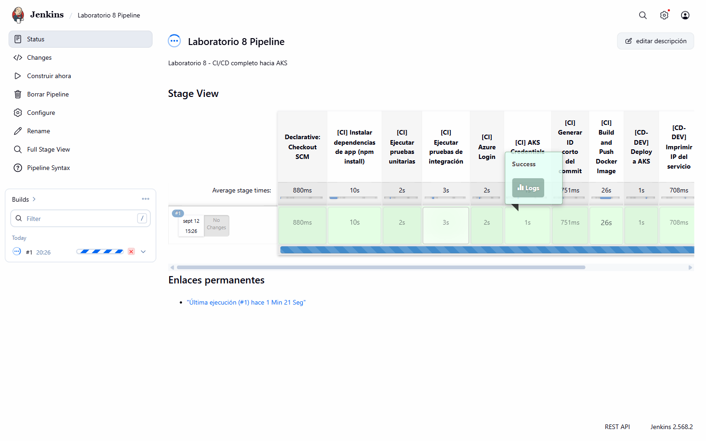
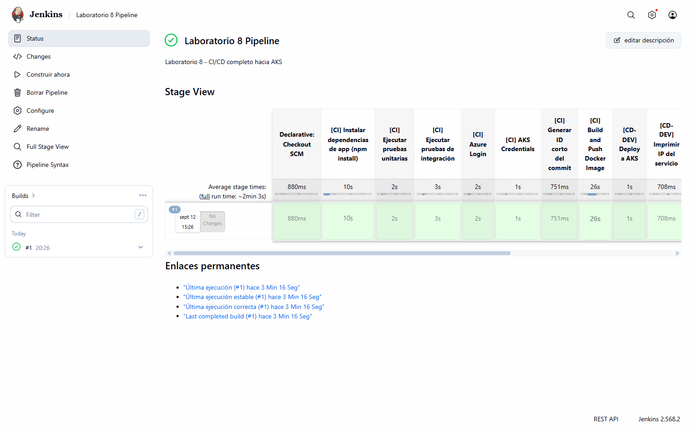
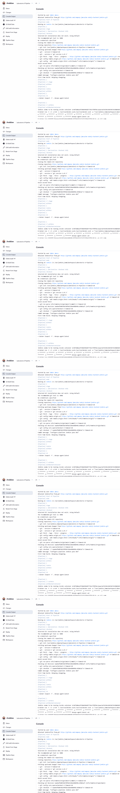

# Laboratorio 8 - Pipeline CI/CD Jenkins hacia AKS

**Autor:** Joe Meza  
**Fecha de ejecucion:** 12 de septiembre de 2026  
**Repositorio:** `company-jmeza/ms-nodejs-backend-jenkins`  
**Commit desplegado:** `3aa66ef`

## Objetivo

Implementar y validar un pipeline CI/CD en Jenkins que ejecute pruebas, publique una imagen Docker y despliegue la misma version en AKS para DEV, QA y PRD con aprobaciones manuales.

## Ejercicio N° 1 - Pipeline CI/CD hacia AKS

### Pipeline

La definicion se almacena en `Jenkinsfile` y usa `devops-agent:latest`. Los stages ejecutados fueron:

1. `[CI] Instalar dependencias de app (npm install)`.
2. `[CI] Ejecutar pruebas unitarias`.
3. `[CI] Ejecutar pruebas de integracion`.
4. `[CI] Azure Login`.
5. `[CI] AKS Credentials`.
6. `[CI] Generar ID corto del commit`.
7. `[CI] Build and Push Docker Image`.
8. `[CD-DEV] Deploy a AKS`.
9. `[CD-DEV] Imprimir IP del servicio`.
10. `Aprobacion QA`.
11. `[CD-QA] Deploy a AKS`.
12. `[CD-QA] Imprimir IP del servicio`.
13. `Aprobacion PRD`.
14. `[CD-PRD] Deploy a AKS`.
15. `[CD-PRD] Imprimir IP del servicio`.

### Pruebas

| Suite | Resultado |
|---|---|
| Unitarias | 4 pruebas aprobadas |
| Integracion | 5 pruebas aprobadas |
| Pipeline Jenkins | Build 1 `SUCCESS` |

### Despliegues

El manifiesto `k8s.yml` genera Deployment y Service LoadBalancer dentro del namespace indicado por `${ENV}`. Los tres ambientes utilizaron la misma imagen inmutable `acrjmeza.azurecr.io/my-nodejs-app-jmeza:3aa66ef`.

| Ambiente | Deployment | Estado | Validacion HTTP |
|---|---|---|---|
| DEV | `my-nodejs-app-jmeza-dev` | `1/1` | HTTP 200 |
| QA | `my-nodejs-app-jmeza-qa` | `1/1` | HTTP 200 |
| PRD | `my-nodejs-app-jmeza-prd` | `1/1` | HTTP 200 |

QA fue desplegado solo despues de su aprobacion manual. PRD fue desplegado solo despues de una segunda aprobacion independiente. `kubectl rollout status` valido cada Deployment antes de consultar la IP del servicio.

### Evidencias del ejercicio 1

## Resultado

El pipeline completo finalizo en `SUCCESS`. DEV, QA y PRD quedaron disponibles en AKS, cada uno en su namespace, y sus endpoints `/api/items` respondieron HTTP 200. Stage View mostro visualmente los quince stages, las dos pausas de aprobacion y el resultado final.

## Seguridad

Azure Login se ejecuta con credenciales Jenkins enmascaradas y salida silenciosa. No se imprimen secretos ni se incluyen credenciales en `Jenkinsfile`, `k8s.yml`, capturas o repositorio.
